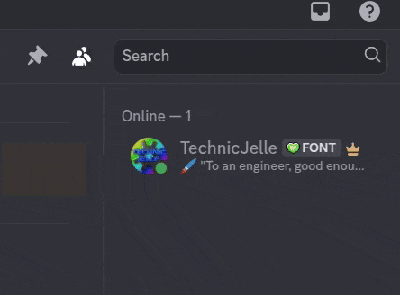

# Cancel Discord Support Website

Quickly closes the Discord Support page after being opened through a misclick.

I often use the Inbox feature in Discord, but sometimes I accidentally misclick on the Help button,
which opens the Discord support website, which I don't need.  
This Firefox extension automatically closes that website again, and minimizes the browser window again, too,
so you'll barely notice that opened at all!

## [Click to install](https://github.com/TechnicJelle/CancelDiscordSupportWebsite/releases/latest/download/CancelDiscordSupportWebsite.xpi)

Tested on Firefox only.
Chrome users who want to use this addon should switch browsers.
